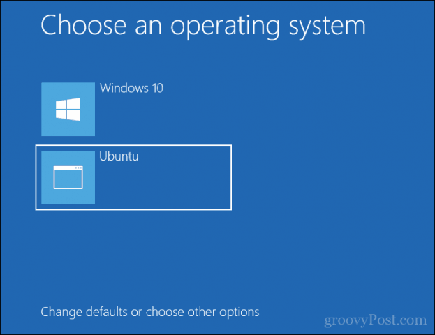
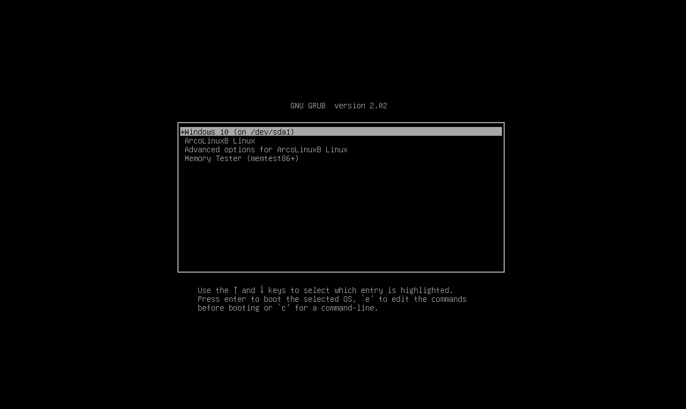
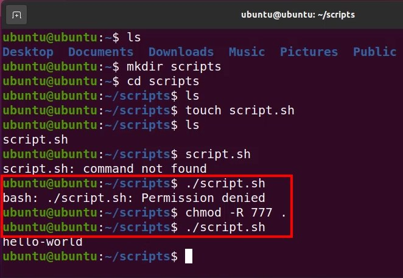
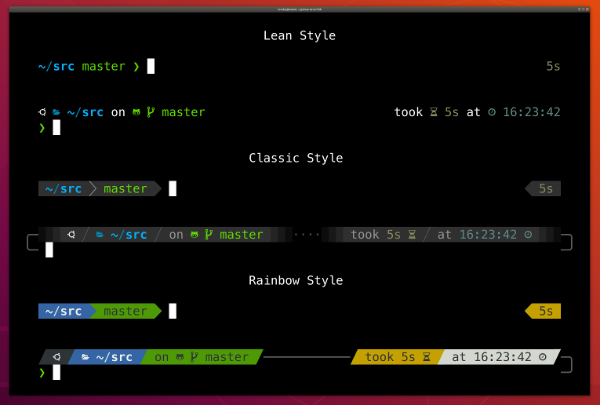

# Operating System

Vì mình là dân dev nên tui nghĩ mình nên tập dùng các hệ điều hạnh dựa trên UNIX (như macos hoặc các distro của linux) dần đi là vừa. Môi trường của Windows cực kì khó chịu về những khoản như tên folder dùng "\" chứ không dùng "/", hoặc sẽ đòi hỏi quyền truy cập các folder, hoặc sẽ rất khó để setup các biến environment. Ở đây tui sẽ hướng dẫn mọi người các bước để cài Linux cho nhanh (sử dụng ***Ubuntu 22.04 LTS*** cho dễ nếu như mn chưa quen sử dụng linux). Bạn nào dùng macos thì thôi inb tui cho khỏe 

## Virtual Machine

Nếu RAM của máy bạn là 8GB (khuyến khích 16GB) trở lên thì dùng phương án này.

1. Cài đặt 1 hypervisor (Oracle Virtual Box, VMWare Workstation Player,...). Khuyên dùng VMWare Workstation Player.
2. Lên youtube tìm hiểu cách cài Ubuntu cho cái hypervisor mình dùng. Ví dụ: "Cách cài máy ảo Ubuntu trên máy ảo VMWare Workstation Player", "cài máy ảo Ubuntu cho windows 10/11", "how to install ubuntu virtual machine"

## Windows Subsystem for Linux or WSL

* **Khuyên dùng** nếu RAM của máy bạn là 8GB hoặc ít hơn, nhưng không còn nhiều ổ cứng/ít. (máy mà đủ trâu để chạy Virtual Machine thì chạy WSL ngon ơ yên tâm)
* Mọi người có thể đọc qua [link này](https://learn.microsoft.com/en-us/windows/wsl/install) để có hướng dẫn cụ thể.
* Hoặc nếu lười đọc docs thì mình có tìm thấy [link youtube này](https://youtu.be/aIYhaeJa90g?si=bqBFyaN3AM4gZRJo).

## Dual boot Ubuntu

* Nếu máy bạn quá yếu để chạy 2 cái trên. Còn 1 cách là mình sẽ vừa chạy Ubuntu vừa chạy Windows 10/11. Bình thường khi mở máy lên bạn sẽ vào thẳng windows 10/11 luôn. Nhưng khi cài dual boot thì sau khi cài đặt thành công bạn sẽ phải lựa chọn option như này thế này:   
hoặc như này: 
* Vì nó hơi dài nên mình cũng lười hướng dẫn ở đây. Bạn có thể lên youtube tìm hiểu thử cách dual boot. Từ khóa có thể như "how to install dual boot Ubuntu on Windows" hoặc "cách dual boot Ubuntu trên Windows".

# Dev Environment

## Shell

(Bạn có thể skip bước này)

* Vì là dân dev nên mình sẽ thường xuyên đụng vào Shell.
* Shell thường được biết tới ở Windows là Command Prompt (cmd) hoặc Windows Powershell, còn ở các hệ điều hành UNIX thì được gọi là Terminal.
* Ở đây mình khuyên các bạn chỉ nên dùng Terminal hoặc Powershell (né cmd ra). Vì 2 chúng nó đều sử dụng Bash làm ngôn ngữ Shell mặc định.
* Mình sẽ tóm tắt cho bạn cách làm cho môi trường shell của bạn tốt hơn như sau:

  1. Cài zsh. Đây là ngôn ngữ Shell có nhiều điểm tương đồng với bash nhưng có thể tùy chỉnh nhiều thứ!
  2. Cài oh-my-zsh. Đây là một cái framework giúp bạn tùy chỉnh zsh một cách dễ dàng hơn!
  3. (có thể skip) Cài powerlevel10k. Đây là một cái theme cho zsh. Nếu như có oh-my-zsh thì cài cái powerlevel10k sẽ dễ dàng hơn nhiều

  * Nếu bạn nào cài Ubuntu qua WSL rồi thì có thể dùng link youtube này [(tiếng Việt)](https://youtu.be/jtk3Aw1wqRQ?si=mYDREyBC2JO3qrUa) [(tiếng Anh)](https://youtu.be/235G6X5EAvM?si=8Y1mlvRivkU0un24)
  * Nếu cài Ubuntu qua Virtual Machine hoặc Dual boot thì có thể vào [(link này (tiếng Anh))](https://youtu.be/z7wzRKkYdFg?si=b2Dc-43cDpOjpbgH)
* Sau khi cài xong thì SHELL của bạn sẽ từ như này  sang như này 

## Git and Github
### Git
1. Nếu đã cài Ubuntu rồi thì mở terminal lên chạy:
```sh
sudo apt install git
```
2. Nếu có hệ điều hành nào khác thì tham khảo ở [đây](https://git-scm.com/book/en/v2/Getting-Started-Installing-Git)
### Github
Ở đây mình sẽ setup SSH key cho máy bạn. Chủ yếu là để thao tác git lên remote repository (git push/git pull) cho nhanh thôi
1. Vào [link này](https://docs.github.com/en/authentication/connecting-to-github-with-ssh/generating-a-new-ssh-key-and-adding-it-to-the-ssh-agent?platform=windows)
2. Chọn hệ điều hành của các bạn
3. Thực hiện các bước ở mục **Generating a new SSH key**
4. Thực hiện các bước ở mục **Adding your SSH key to the ssh-agent**
5. Vào [link này](https://docs.github.com/en/authentication/connecting-to-github-with-ssh/adding-a-new-ssh-key-to-your-github-account?tool=webui&platform=mac)
7.Thực hiện các bước ở mục **Adding a new SSH key to your account**

Cái này nếu thấy khó quá thì lên youtube tìm từ khóa "ssh github"
## Python

Vì python khá lằng nhằng về mấy cái version nên mình sẽ sử dụng 1 cái package manager cho python tên là poetry (cho web app hay bất cứ cái gì thì mình thích dùng poetry, cho data science hay AI thì mình thích dùng miniconda3)

1. Cài đặt pipx. Xem cách cài đặt [ở đây](https://github.com/pypa/pipx).
2. Cài poetry qua pipx (xem [link này](https://python-poetry.org/docs/#installing-with-pipx)):
```sh
pipx install poetry
```
3. Config cho pipx để folder của environment nằm trên cùng folder của project:
```sh
poetry config virtualenvs.in-project true
```

Sau cái này thì mấy bạn đọc cách setup môi trường trong README.md là được